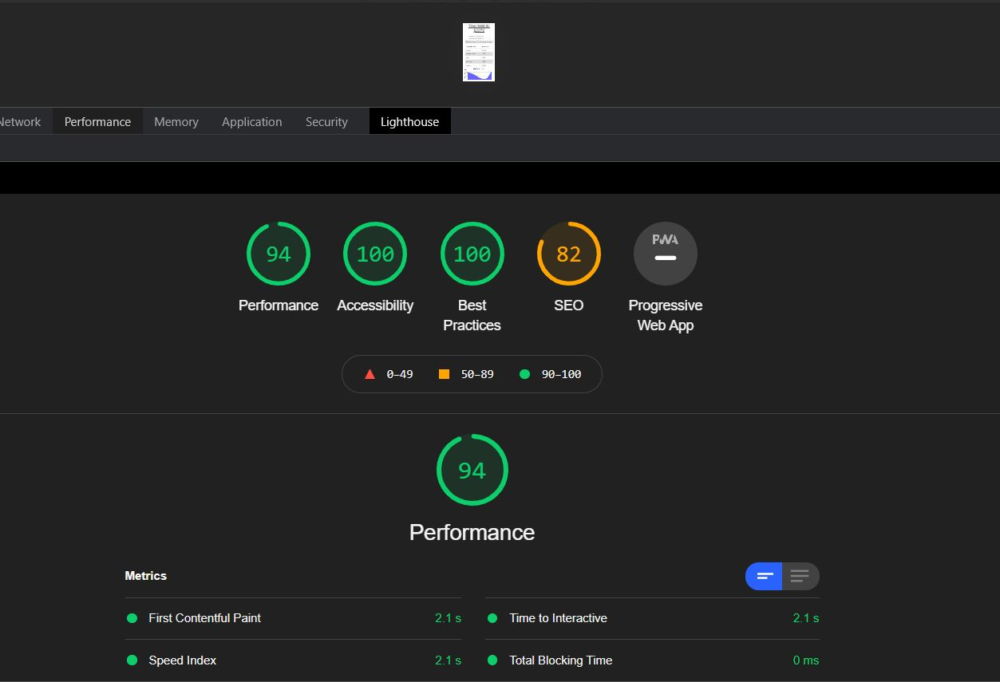
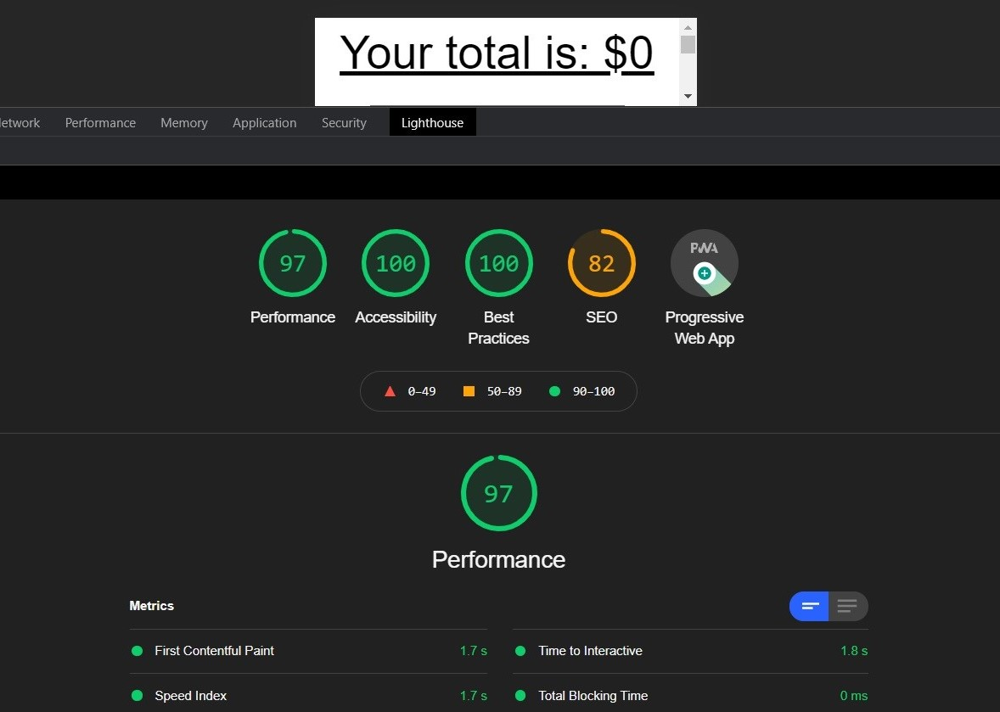

# Progressive-On-Off-BudgetTracker

## Contents

1. [Technologies-Used](#Technologies-Used)
2. [Description](#Description)
3. [Deploy](#Link)
4. [Usage](#Usage)
5. [License](#License)
6. [Credits](#Credits)
7. [Contributing](#Contributing)
8. [Questions](#Questions)

## Technologies-Used

1. Javascript
2. Node.js
3. Node packages
   - express
   - mongoose
   - morgan
   - compression
4. MongoDB / mongoDB ATLAS
5. Heroku
6. PWA

## Description

- An Application that can save your budget. Also, user able to see the last budget transactions.

## Deployed application link

- [Deployed Link](https://progressivebudget-on-off.herokuapp.com/)

## Usage

- User only needs to add or subtract funds, it will save to the database and will show the income and outgoings with the graphs.

| Before                                        | After                                        |
| --------------------------------------------- | -------------------------------------------- |
|  |  |

## License

- 

## Credits

- Front End code was given by Triology, Service workers / IndexedDB / deploy page / server connections created by Tolga Secme.

## Contributing

- No contributes.

##  Questions

- E-mail me for any questions [tolgasecme@icloud.com](mailto:tolgasecme@icloud.com)
- Also you can find me on Github [TolgaS92](https://github.com/TolgaS92).
